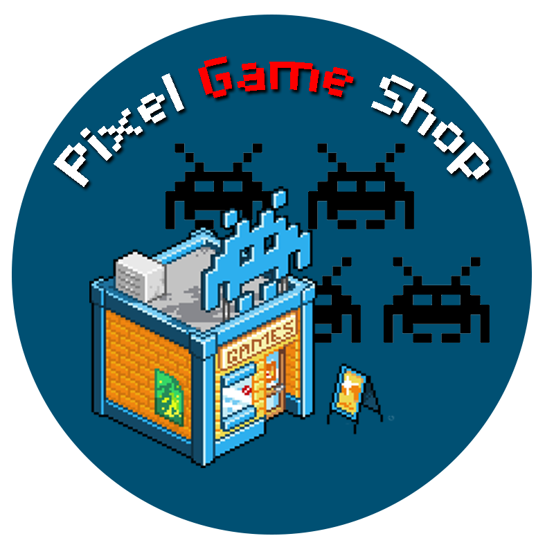

<!-- HEADER -->
<br />
<p align="center">
 <a href="https://github.com/Deathmajorasmask/Pixel-Game-Shop">
    
 </a>

  <h3 align="center">Pixel Game Shop</h3>

  <p align="center">
    An awesome Online Shop developed in Java web !
    <br />
  </p>
</p>

<!-- TABLE OF CONTENTS -->
<details open="open">
  <summary>Table of Contents</summary>
  <ol>
    <li>
      <a href="#about-the-project">About The Project</a>
      <ul>
        <li><a href="#built-with">Built With</a></li>
      </ul>
    </li>
    <li>
      <a href="#getting-started">Getting Started</a>
      <ul>
        <li><a href="#prerequisites">Prerequisites</a></li>
        <li><a href="#installation">Installation</a></li>
      </ul>
    </li>
    <li><a href="#screenshots">Screenshots</a></li>
    <li><a href="#roadmap">Roadmap</a></li>
    <li><a href="#contributing">Contributing</a></li>
    <li><a href="#license">License</a></li>
    <li><a href="#contact">Contact</a></li>
  </ol>
</details>


<!-- ABOUT THE PROJECT -->
## About The Project

[![Product Name Screen Shot][screenshot]](https://github.com/Deathmajorasmask/Pixel-Game-Shop)

It is a standard online store, developed in java, with the current essential requirements used by other online stores. It can be used as a basis for the development of another online store.

The software has a shopping cart, product categories, product search, shopping system, creation of user and administrator accounts, and much more. Everything is saved through MySQL.

### Built With

This project uses some external libraries, I list them below:
* [apache-tomcat](https://tomcat.apache.org/download-90.cgi)
* [mysql-connector-java-8.0](https://dev.mysql.com/doc/connector-j/8.0/en/)
* [Bootstrap 4.3](https://getbootstrap.com/)


<!-- GETTING STARTED -->
## Getting Started

Follow the instructions below to get it working and proceed to modify or test this project.

### Prerequisites

You will have to download.
* NetBeans IDE 11.1
* mysql


### Installation

1. Clone the repo
   ```sh
   git clone https://github.com/Deathmajorasmask/Pixel-Game-Shop.git
   ```
2. Import 'proyectopapw.sql' to mysql.

3. Open Pixel-Game-Shop in NetBeans.

4. Select Tools > Server > Apache TomCat and select 'apache-tomcat-9.0.27' create user / password

5. Select 'mysql-connector-java-8.0.18.jar' and click in connect db

6. if there is an error connecting to the database, enter the following script in mysql:
   ```sh
   SET GLOBAL time_zone = '+3:00';
   ```

7. Run Pixel-Game-Shop.

8. Open Pixel-Game-Shop in Chrome, Firefox or Opera.
   ```sh
   http://localhost/
   ```


## Screenshots
![Product Name Screen Shot][screenshot01]
![Product Name Screen Shot][screenshot02]
![Product Name Screen Shot][screenshot03]


<!-- ROADMAP -->
## Roadmap

See the [open issues](https://github.com/Deathmajorasmask/Pixel-Game-Shop/issues) for a list of proposed features (and known issues).


<!-- CONTRIBUTING -->
## Contributing

Contributions are what make the open source community such an amazing place to learn, inspire, and create. Any contributions you make are **greatly appreciated**.

1. Fork the Project
2. Create your Feature Branch (`git checkout -b feature/AmazingFeature`)
3. Commit your Changes (`git commit -m 'Add some AmazingFeature'`)
4. Push to the Branch (`git push origin feature/AmazingFeature`)
5. Open a Pull Request


<!-- LICENSE -->
## License

Distributed under the MIT License. See `LICENSE` for more information.


<!-- CONTACT -->
## Contact

Deathmajorasmask - zijaham_link@hotmail.com

Project Link: [https://github.com/Deathmajorasmask/Pixel-Game-Shop](https://github.com/Deathmajorasmask/Pixel-Game-Shop)


<!-- MARKDOWN LINKS & IMAGES -->
[screenshot]: images/index_PixelGameShop.JPG
[screenshot01]: images/login_PixelGameShop.JPG
[screenshot02]: images/Screen01_PixelGameShop.JPG
[screenshot03]: images/Screen02_PixelGameShop.JPG
